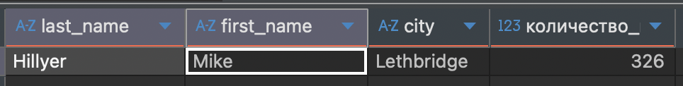
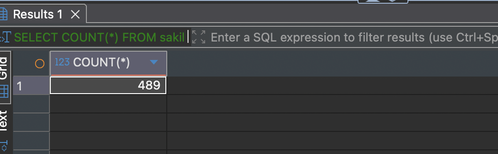
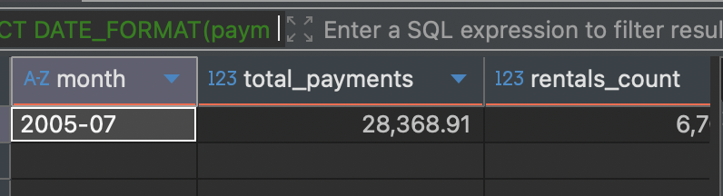

Домашнее задание к занятию "`SQL. Часть 2`" - `Кошель Николай Павлович`

### Задание 1

Одним запросом получите информацию о магазине, в котором обслуживается более 300 покупателей, и выведите в результат следующую информацию: 
- фамилия и имя сотрудника из этого магазина;
- город нахождения магазина;
- количество пользователей, закреплённых в этом магазине.
```sql
SELECT
    staff.last_name,
    staff.first_name,
    city.city,
    COUNT(customer.customer_id) AS количество_покупателей
FROM
    sakila.store
JOIN
    sakila.address ON sakila.address.address_id = sakila.store.address_id
JOIN
    sakila.city ON sakila.city.city_id = sakila.address.city_id
JOIN
    sakila.staff ON sakila.store.manager_staff_id = sakila.staff.staff_id
JOIN
    sakila.customer ON sakila.customer.store_id = sakila.store.store_id
GROUP BY
    store.store_id, staff.first_name, staff.last_name,  store.store_id
HAVING
    COUNT(customer.customer_id) > 300;
```

### Задание 2

Получите количество фильмов, продолжительность которых больше средней продолжительности всех фильмов.
```sql
SELECT COUNT(*) 
FROM sakila.film
WHERE length > (SELECT AVG(length) FROM sakila.film);
```

### Задание 3

Получите информацию, за какой месяц была получена наибольшая сумма платежей, и добавьте информацию по количеству аренд за этот месяц.

```sql
SELECT DATE_FORMAT(payment_date, '%Y-%m') AS month, SUM(amount) AS total_payments, COUNT(*) AS rentals_count
FROM sakila.payment
GROUP BY month
ORDER BY total_payments DESC
LIMIT 1;
```
